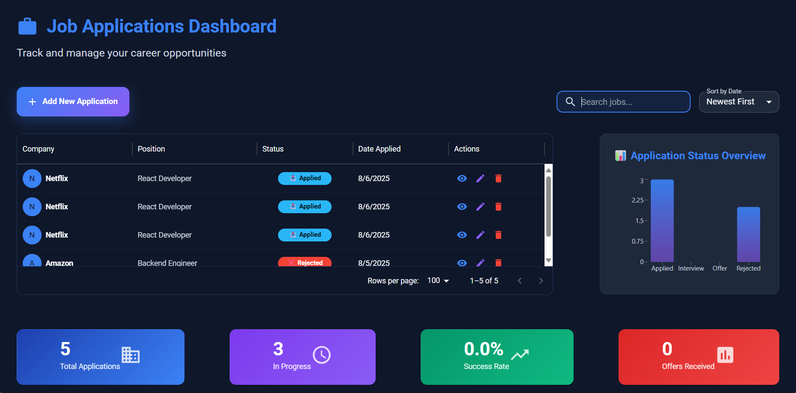

# Job Application Tracker 

**Your personal job search companion** — track applications, interview status, and notes in one clean, interactive dashboard.



## About This Project

- **Full-stack expertise**: React frontend + ASP.NET Core Web API + SQL Server (with EF migrations).
- **UI/UX focus**: Clean, intuitive interface using Material UI DataGrid, charts, and form validation.
- **Reusable & scalable**: Modular components and API/client separation.
- **Practical use case**: Designed to manage job applications — something every growth seeker could use.

---

## Tech Stack

- **Frontend**: React, Material UI, React Hook Form, Recharts (for analytics)
- **Backend**: ASP.NET Core Web API, Entity Framework Core
- **Database**: SQL Server (with EF migrations)
- **Deployment-ready**: Structured for future expansion

---

##  Key Features

- Add, edit, and delete job applications
- Track application status with a clean, sortable DataGrid
- Dashboard summary with charts to visualize progress
- Store resume links for quick reference
- Notes section for reminders and interview prep

---

## Demo Video

 [Watch Demo Video](https://drive.google.com/file/d/1xWFLoRgiUja-4v39F5opFokeXKn6un7Q/view?usp=sharing)

---

##  How to Run Locally

1. Clone the repo:
   ```bash
   git clone https://github.com/NuzhatUlAin/Job-Tracker.git
2. Navigate and run the client:
   ```bash
   cd jobtracker-client
   npm start
3. Navigate and run the API
	```bash
   cd JobTrackerApi
   dotnet build
   dotnet run
